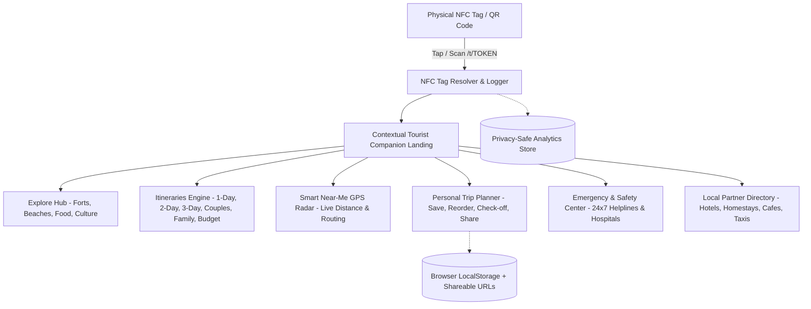

# IMPLEMENTATION PLAN — RATNAGIRI NFC TOURIST COMPANION PLATFORM

Transforming the Django platform into a commercial-grade, physical-to-digital **NFC Tourist Companion** for travellers visiting Ratnagiri, Maharashtra.

---

## 1. User Review & Architectural Invariants

- **Zero-Breaking-Change Strategy:** All existing apps (`destinations`, `spots`, `food`, `reviews`, `users`, `accounts`, `core`, `api`) and all 36 automated unit tests will remain intact and green.
- **Dedicated Modular App (`companion`):** All new NFC tag resolution, modular itinerary models, partners, emergency services, and privacy-safe analytics will live cleanly inside a new `companion` app to maintain clear separation of concerns.
- **No Mandatory Login for Tourists:** The personal trip planner, saved places, and itinerary progress will work seamlessly via client-side LocalStorage and URL-based trip sharing, while still supporting authenticated user sync when logged in.
- **Physical NFC URL Scheme:** The tag endpoint will be short and fast: `/t/<tag_uid>/` (with fallback to QR code scan). Tapping resolves the tag, logs anonymized telemetry, and delivers an instant contextual mobile experience.

---

## 2. Core Modules & Database Architecture

### 2.1 Models inside `companion/models.py`
1. **`NFCTag`**: Hardware token, label, campaign type, redirect/experience target, assigned partner/destination/itinerary, welcome overrides, tap counters.
2. **`NFCTapEvent`**: Privacy-safe event stream with anonymized daily session hash, device type, referrer, timestamp, and actions.
3. **`Itinerary`**, **`ItineraryDay`**, **`ItineraryStop`**: Dynamic hierarchy for full multi-day travel guides with durations, distance estimates, stop types (Morning, Breakfast, Sightseeing, Sunset, Dinner, etc.), and GPS coordinates.
4. **`Partner`**: Local merchants (Hotels, Homestays, Cafes, Tour Operators, Taxis) with contact cards, verification badges, and assigned tag counts.
5. **`EmergencyContact`**: 24x7 emergency phone numbers, category (Police, Hospital, Ambulance, Tourist Helpline), location coordinates, and tap-to-call links.

---

## 3. Step-by-Step Implementation Roadmap

- **Phase 5:** Build core data models in `companion/models.py`, register in `settings.py`, and run migrations.
- **Phase 6:** Build the NFC experience (`/t/<token>/` resolver, tap tracker, QR fallback generator, and landing router).
- **Phase 7:** Build Contextual NFC Companion Landing & Homepage integration.
- **Phase 8:** Build Explore Hub with category filters and smart near-me client GPS radar.
- **Phase 9:** Build Itinerary Engine with Day & Stop timelines, map directions, and audience filters.
- **Phase 10:** Enhance Place pages with "+ Add to Trip" integration and GPS routing buttons.
- **Phase 11:** Build Zero-Login Personal Trip Planner (`/my-trip/`) with LocalStorage sync and shareable URL generation (`/my-trip/share/`).
- **Phase 12:** Build Django Admin CMS extensions for managing tags, itineraries, stops, partners, and emergency contacts.
- **Phase 13:** Build Privacy-Safe NFC Analytics dashboard (`/analytics/`).
- **Phase 14:** Mobile ergonomics, PWA manifest (`manifest.json`), service worker, and bottom navigation bar.
- **Phase 15:** Comprehensive test suite execution and verification.
